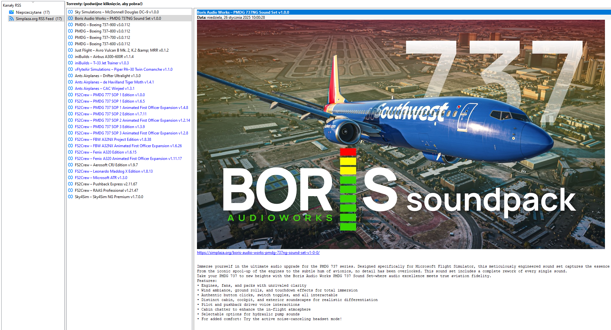

# SimPlazaRSS
SimPlaza.org and SceneryAddons.org ETL (scraper/parser) which generates RSS feed with Magnet Links.

# Install
Run `install.sh` to prepare Pipenv's Virtual Environment.

# Run Scraper
The scraper needs to run periodically. Set up cron entry to execute `run.sh` every hour.

The script will scrape first two pages and prepare `SimPlaza.org.html` and `SceneryAddons.org` for the RSS feed server.

# Run Server
Created html files needs to be served using http server.

If you have one set up, you can just copy the file to the appropriate directory.

If not, you can run python http server using `http_server.sh`. It will serve the file on port 8080, which you can change.

# Configuring RSS reader
Use:
- `http://your_http_server_ip:port/SimPlaza.org.html`.
- `http://your_http_server_ip:port/SceneryAddons.org.html`.

Example:
- `http://192.168.0.12:8080/SimPlaza.org.html`.
- `http://192.168.0.12:8080/SceneryAddons.org.html`.

# Effect
